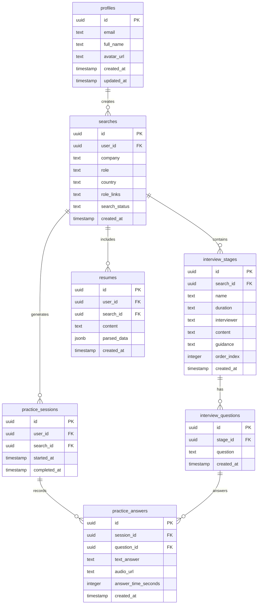

# Technical Design Document: INT - Interview Prep Tool

## 1. System Architecture Overview

### 1.1 High-Level Architecture

```
┌─────────────────┐    ┌──────────────────┐    ┌─────────────────┐
│   React Client  │    │  Supabase Stack  │    │  OpenAI API     │
│                 │    │                  │    │                 │
│ • React + Vite  │◄──►│ • PostgreSQL     │    │ • GPT-4.1       │
│ • TypeScript    │    │ • Auth           │◄──►│ • Deep Research │
│ • Tailwind CSS  │    │ • Edge Functions │    │ • Completions   │
│ • shadcn/ui     │    │ • Storage        │    │                 │
└─────────────────┘    └──────────────────┘    └─────────────────┘
```

### 1.2 Technology Stack

#### Frontend
- **Framework:** React 18 with TypeScript
- **Build Tool:** Vite for fast development and optimized builds
- **Styling:** Tailwind CSS with custom design system
- **UI Components:** shadcn/ui for consistent, accessible components
- **State Management:** React Context for auth, React Query for server state
- **Routing:** React Router v6 for client-side navigation

#### Backend
- **Database:** Supabase PostgreSQL with Row Level Security (RLS)
- **Authentication:** Supabase Auth (email/password)
- **API Layer:** Supabase Edge Functions (Deno runtime)
- **File Storage:** Supabase Storage for CV uploads (future)

#### External Services
- **AI Research:** OpenAI API (GPT-4.1-2025-04-14)
- **Deployment:** Lovable hosting platform

## 2. Database Schema

### 2.1 Entity Relationship Diagram



### 2.2 Table Specifications

#### profiles
- **Purpose:** Store user profile information
- **RLS Policies:** Users can view/update their own profile only
- **Indexes:** Primary key on id, unique on email

#### searches
- **Purpose:** Track user search queries and results
- **RLS Policies:** Users can create/view their own searches only
- **Indexes:** Primary key on id, foreign key on user_id, index on created_at

#### interview_stages
- **Purpose:** Store structured interview process stages
- **RLS Policies:** Users can view stages for their searches only
- **Indexes:** Primary key on id, foreign key on search_id, index on order_index

#### interview_questions
- **Purpose:** Store questions for each interview stage
- **RLS Policies:** Users can view questions for their interview stages only
- **Indexes:** Primary key on id, foreign key on stage_id

#### resumes
- **Purpose:** Store user CVs and parsed metadata
- **RLS Policies:** Users can create/view their own resumes only
- **Indexes:** Primary key on id, foreign keys on user_id and search_id

#### practice_sessions & practice_answers
- **Purpose:** Track practice sessions and user responses
- **RLS Policies:** Users can create/view their own sessions and answers
- **Indexes:** Primary keys, foreign key relationships, index on created_at

## 3. API Design

### 3.1 Edge Function: interview-research

#### Endpoint
`POST /functions/v1/interview-research`

#### Request Schema
```typescript
interface ResearchRequest {
  company: string;
  role?: string;
  country?: string;
  roleLinks?: string[];
  cv?: string;
  userId: string;
  searchId: string;
}
```

#### Response Schema
```typescript
interface ResearchResponse {
  status: "success" | "error";
  message: string;
  searchId?: string;
}
```

#### Processing Flow
1. **Input Validation:** Verify required fields and user authentication
2. **Status Update:** Set search status to "processing"
3. **AI Research:** Call OpenAI API with structured prompt
4. **Data Parsing:** Extract interview stages and questions from AI response
5. **Database Insert:** Store structured results in database tables
6. **CV Processing:** Parse and store CV data if provided
7. **Status Update:** Set search status to "completed"
8. **Response:** Return success/error status

### 3.2 Client-Side API Layer

#### Search Service
```typescript
// src/services/searchService.ts
export class SearchService {
  static async createSearch(params: SearchParams): Promise<string>
  static async getSearchResults(searchId: string): Promise<SearchResults>
  static async getUserSearches(userId: string): Promise<Search[]>
}
```

#### Authentication Hook
```typescript
// src/hooks/useAuth.ts
export const useAuth = () => {
  user: User | null;
  session: Session | null;
  loading: boolean;
  signIn: (email: string, password: string) => Promise<AuthError | null>;
  signUp: (email: string, password: string) => Promise<AuthError | null>;
  signOut: () => Promise<void>;
}
```

## 4. Component Architecture

### 4.1 Component Hierarchy

```
App
├── AuthProvider
├── Router
│   ├── Home
│   │   └── SearchForm
│   ├── Dashboard
│   │   ├── ProcessOverview
│   │   ├── PreparationTable
│   │   └── LoadingState
│   ├── Practice
│   │   ├── QuestionCard
│   │   ├── RecordingControls
│   │   └── Timer
│   ├── Profile
│   │   ├── CVUpload
│   │   └── UserSettings
│   ├── Auth
│   │   ├── SignInForm
│   │   └── SignUpForm
│   └── Navigation
└── Toaster
```

### 4.2 State Management Strategy

#### Global State (React Context)
- **AuthContext:** User authentication state and methods
- **ThemeContext:** Design system theme (future dark mode)

#### Server State (React Query)
- **Search queries:** Cached search results and user history
- **Real-time updates:** WebSocket connections for search progress

#### Local State (useState/useReducer)
- **Form state:** User input in search and practice forms
- **UI state:** Loading states, modal visibility, navigation

## 5. Security Architecture

### 5.1 Authentication & Authorization

#### Authentication Flow
1. **User Registration:** Email/password via Supabase Auth
2. **Session Management:** JWT tokens with automatic refresh
3. **Route Protection:** Private routes require valid session
4. **Email Verification:** Optional for faster testing (configurable)

#### Authorization Model
- **Row Level Security (RLS):** Database-level access control
- **User Isolation:** All data scoped to authenticated user
- **API Security:** Edge functions validate user context

### 5.2 Data Protection

#### Sensitive Data Handling
- **CV Content:** Encrypted at rest, user-deletable
- **Search History:** User-scoped, automatic cleanup policies
- **API Keys:** Stored in Supabase secrets, not exposed to client

#### Privacy Measures
- **Data Minimization:** Only collect necessary information
- **User Control:** Full data export and deletion capabilities
- **Secure Transport:** HTTPS/TLS for all communications

## 6. Performance Optimization

### 6.1 Frontend Optimizations

#### Bundle Optimization
- **Code Splitting:** Route-based lazy loading
- **Tree Shaking:** Eliminate unused code
- **Asset Optimization:** Optimized images and fonts

#### Runtime Performance
- **React Optimization:** useMemo, useCallback for expensive operations
- **Virtualization:** For large question lists (future)
- **Caching:** React Query for server state, localStorage for user preferences

### 6.2 Backend Optimizations

#### Database Performance
- **Indexing Strategy:** Optimized queries for common access patterns
- **Connection Pooling:** Supabase handles connection management
- **Query Optimization:** Efficient joins and filtering

#### API Performance
- **Response Caching:** Cache AI responses for common companies
- **Request Batching:** Batch database operations
- **Error Handling:** Graceful degradation and retries

## 7. Monitoring & Observability

### 7.1 Application Monitoring

#### Error Tracking
- **Client Errors:** Console logging and user feedback
- **Server Errors:** Edge function logs and Supabase analytics
- **Performance Metrics:** Core Web Vitals tracking

#### User Analytics
- **Feature Usage:** Track search completions and practice sessions
- **Performance Data:** API response times and success rates
- **User Feedback:** In-app feedback collection

### 7.2 System Health

#### Service Dependencies
- **OpenAI API:** Monitor rate limits and response quality
- **Supabase Services:** Database and auth service health
- **Edge Functions:** Deployment status and execution logs

## 8. Deployment & DevOps

### 8.1 Deployment Pipeline

#### Development Workflow
1. **Local Development:** Vite dev server with hot reload
2. **Code Quality:** ESLint, TypeScript checks
3. **Testing:** Component and integration tests (future)
4. **Preview:** Automatic deployment on code changes

#### Production Deployment
- **Build Process:** Optimized production build via Vite
- **Static Hosting:** Lovable platform deployment
- **CDN:** Global content delivery for performance

### 8.2 Environment Configuration

#### Environment Variables
```typescript
// Development
VITE_SUPABASE_URL=<project-url>
VITE_SUPABASE_ANON_KEY=<anon-key>

// Production (Supabase Secrets)
OPENAI_API_KEY=<openai-key>
SUPABASE_SERVICE_ROLE_KEY=<service-key>
```

## 9. Testing Strategy

### 9.1 Testing Pyramid

#### Unit Tests (Future)
- **Component Testing:** React Testing Library
- **Utility Functions:** Jest for business logic
- **API Functions:** Mock external dependencies

#### Integration Tests (Future)
- **User Flows:** End-to-end scenarios
- **Database Operations:** Test RLS policies
- **Edge Functions:** API contract testing

#### Manual Testing
- **User Acceptance:** Feature validation with target users
- **Cross-browser:** Chrome, Firefox, Safari compatibility
- **Mobile Testing:** Responsive design validation

## 10. Scalability Considerations

### 10.1 Technical Scalability

#### Database Scaling
- **Read Replicas:** For high-traffic read operations
- **Partitioning:** Time-based partitioning for large tables
- **Caching Layer:** Redis for frequently accessed data

#### Application Scaling
- **Horizontal Scaling:** Stateless Edge Functions
- **Load Balancing:** Supabase handles traffic distribution
- **CDN Strategy:** Static asset caching globally

### 10.2 Feature Scalability

#### Extensibility Points
- **AI Model Flexibility:** Support for multiple AI providers
- **Plugin Architecture:** Modular feature additions
- **API Versioning:** Backward-compatible API evolution

## 11. Risk Mitigation

### 11.1 Technical Risks

#### Dependency Risks
- **OpenAI API Changes:** Version pinning and fallback strategies
- **Supabase Updates:** Regular testing of new versions
- **Browser Compatibility:** Progressive enhancement approach

#### Performance Risks
- **AI Response Time:** Timeout handling and user communication
- **Database Growth:** Query optimization and archival strategies
- **Traffic Spikes:** Rate limiting and graceful degradation

### 11.2 Operational Risks

#### Data Loss Prevention
- **Backup Strategy:** Automated database backups
- **User Data Export:** Self-service data portability
- **Disaster Recovery:** Multi-region failover planning

This technical design serves as the blueprint for implementation and should be updated as the system evolves and scales.