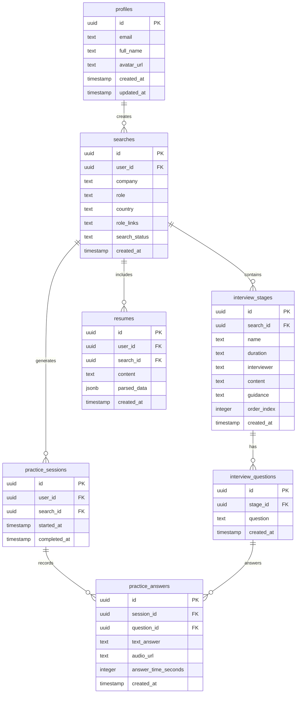

# Technical Design Document: INT - Interview Prep Tool

## Table of Contents
1. [System Architecture Overview](#1-system-architecture-overview)
2. [Database Schema](#2-database-schema)
3. [API Design](#3-api-design)
4. [Authentication Architecture](#4-authentication-architecture)
5. [Component Architecture](#5-component-architecture)
6. [State Management Strategy](#6-state-management-strategy)
7. [Design System](#7-design-system)
8. [Real-time Features](#8-real-time-features)
9. [Error Handling Strategy](#9-error-handling-strategy)
10. [Security Architecture](#10-security-architecture)
11. [Performance Optimization](#11-performance-optimization)
12. [Development Environment](#12-development-environment)
13. [Testing Strategy](#13-testing-strategy)
14. [Scalability Considerations](#14-scalability-considerations)
15. [Risk Mitigation](#15-risk-mitigation)
16. [Quick Reference](#16-quick-reference)

## 1. System Architecture Overview

### 1.1 High-Level Architecture

```
┌─────────────────┐    ┌──────────────────┐    ┌─────────────────┐
│   React Client  │    │  Supabase Stack  │    │  OpenAI API     │
│                 │    │                  │    │                 │
│ • React + Vite  │◄──►│ • PostgreSQL     │    │ • GPT-4.1       │
│ • TypeScript    │    │ • Auth           │◄──►│ • Deep Research │
│ • Tailwind CSS  │    │ • Edge Functions │    │ • Completions   │
│ • shadcn/ui     │    │ • Storage        │    │                 │
└─────────────────┘    └──────────────────┘    └─────────────────┘
```

### 1.2 Technology Stack

#### Frontend
- **Framework:** React 18 with TypeScript
- **Build Tool:** Vite for fast development and optimized builds
- **Styling:** Tailwind CSS with custom design system
- **UI Components:** shadcn/ui for consistent, accessible components
- **State Management:** React Context for auth, React Query for server state
- **Routing:** React Router v6 for client-side navigation

#### Backend
- **Database:** Supabase PostgreSQL with Row Level Security (RLS)
- **Authentication:** Supabase Auth (email/password)
- **API Layer:** Supabase Edge Functions (Deno runtime)
- **File Storage:** Supabase Storage for CV uploads (future)

#### External Services
- **AI Research:** OpenAI API (GPT-4.1-2025-04-14)
- **Deployment:** Lovable hosting platform

### 1.3 Key Design Decisions

#### Why Supabase Over Custom Backend?
- **Rapid Development:** Built-in auth, real-time, and database
- **Row Level Security:** Database-level access control
- **Edge Functions:** Serverless API endpoints with global distribution
- **Type Generation:** Automatic TypeScript types from schema

#### Why shadcn/ui Over Other UI Libraries?
- **Accessibility First:** Built on Radix UI primitives
- **Customizable:** Copy-paste approach allows full customization
- **TypeScript Native:** Excellent type safety and developer experience
- **Design System:** Consistent variant system with CVA

## 2. Database Schema

### 2.1 Entity Relationship Diagram



### 2.2 Table Specifications

#### profiles
- **Purpose:** Store user profile information with auto-creation trigger
- **RLS Policies:** Users can view/update their own profile only
- **Indexes:** Primary key on id, unique on email
- **Auto-creation:** Triggered on `auth.users` insert

#### searches
- **Purpose:** Track user search queries and results
- **Status Flow:** `pending` → `processing` → `completed` | `failed`
- **RLS Policies:** Users can create/view their own searches only
- **Indexes:** Primary key on id, foreign key on user_id, index on created_at

#### interview_stages
- **Purpose:** Store structured interview process stages
- **Ordering:** Uses `order_index` for consistent stage sequence
- **RLS Policies:** Users can view stages for their searches only
- **Indexes:** Primary key on id, foreign key on search_id, index on order_index

#### interview_questions
- **Purpose:** Store questions for each interview stage
- **Generation:** AI-generated during search processing
- **RLS Policies:** Users can view questions for their interview stages only
- **Indexes:** Primary key on id, foreign key on stage_id

#### resumes
- **Purpose:** Store user CVs and parsed metadata
- **Parsing:** JSONB field for structured data extraction
- **RLS Policies:** Users can create/view their own resumes only
- **Indexes:** Primary key on id, foreign keys on user_id and search_id

#### practice_sessions & practice_answers
- **Purpose:** Track practice sessions and user responses
- **Timing:** Records answer duration for performance tracking
- **RLS Policies:** Users can create/view their own sessions and answers
- **Indexes:** Primary keys, foreign key relationships, index on created_at

## 3. API Design

### 3.1 Edge Function: interview-research

#### Endpoint
`POST /functions/v1/interview-research`

#### Request Schema
```typescript
interface ResearchRequest {
  company: string;
  role?: string;
  country?: string;
  roleLinks?: string[];
  cv?: string;
  userId: string;
  searchId: string;
}
```

#### Response Schema
```typescript
interface ResearchResponse {
  status: "success" | "error";
  message: string;
  searchId?: string;
}
```

#### Processing Flow
1. **Input Validation:** Verify required fields and user authentication
2. **Status Update:** Set search status to "processing"
3. **AI Research:** Call OpenAI API with structured prompt
4. **Data Parsing:** Extract interview stages and questions from AI response
5. **Database Insert:** Store structured results in database tables
6. **CV Processing:** Parse and store CV data if provided
7. **Status Update:** Set search status to "completed"
8. **Response:** Return success/error status

#### AI Prompt Strategy
```typescript
const buildResearchPrompt = (company: string, role?: string, country?: string) => {
  let prompt = `Research the interview process at ${company}`;
  if (role) prompt += ` for the ${role} role`;
  if (country) prompt += ` in ${country}`;
  
  prompt += `. Provide a comprehensive analysis including:
  
  1. **Interview Process Overview**: Number of stages, typical timeline, interviewer types
  2. **Detailed Stage Breakdown**: For each stage, provide:
     - Stage name and duration
     - Who conducts it (HR, hiring manager, team members, etc.)
     - What it covers (technical, behavioral, cultural fit, etc.)
     - Specific preparation guidance
     - 4-6 likely questions for that stage
  
  3. **Company-Specific Insights**: 
     - Interview culture and style
     - What they value in candidates
     - Common rejection reasons
     - Tips for standing out
  
  Format your response as a structured analysis with clear sections.`;
  
  return prompt;
};
```

### 3.2 Client-Side API Layer

#### Search Service
```typescript
// src/services/searchService.ts
export const searchService = {
  // Core search operations
  async createSearch(params: CreateSearchParams): Promise<{ searchId?: string; success: boolean; error?: any }>
  async getSearchResults(searchId: string): Promise<{ search: any; stages: any[]; success: boolean; error?: any }>
  async getSearchHistory(): Promise<{ searches?: SearchHistoryItem[]; success: boolean; error?: any }>
  
  // Practice operations
  async createPracticeSession(searchId: string): Promise<{ session?: any; success: boolean; error?: any }>
  async savePracticeAnswer(params: SaveAnswerParams): Promise<{ success: boolean; error?: any }>
  
  // Resume operations
  async saveResume(params: SaveResumeParams): Promise<{ resume?: any; success: boolean; error?: any }>
  async getResume(userId: string): Promise<{ resume?: any; success: boolean; error?: any }>
}
```

#### Error Handling Pattern
```typescript
// Consistent error handling across all service methods
try {
  const { data, error } = await supabase.from('table').operation();
  if (error) throw error;
  return { data, success: true };
} catch (error) {
  console.error("Operation failed:", error);
  return { error, success: false };
}
```

## 4. Authentication Architecture

### 4.1 Authentication Flow

#### Context-Based Authentication
```typescript
// src/components/AuthProvider.tsx
interface AuthContextType {
  user: User | null;
  session: Session | null;
  loading: boolean;
  signIn: (email: string, password: string) => Promise<{ error: any }>;
  signUp: (email: string, password: string) => Promise<{ error: any }>;
  signOut: () => Promise<{ error: any }>;
}

// Critical pattern: Set up listener BEFORE checking session
const { data: { subscription } } = supabase.auth.onAuthStateChange(
  (event, session) => {
    setSession(session);
    setUser(session?.user ?? null);
    setLoading(false);
  }
);

// THEN check for existing session
supabase.auth.getSession().then(({ data: { session } }) => {
  setSession(session);
  setUser(session?.user ?? null);
  setLoading(false);
});
```

#### Protected Routes Pattern
```typescript
// src/App.tsx
const ProtectedRoute = ({ children }: ProtectedRouteProps) => {
  const { user, loading } = useAuthContext();
  const location = useLocation();

  if (loading) {
    return <div className="min-h-screen flex items-center justify-center">Loading...</div>;
  }

  if (!user) {
    // Preserve intended destination for post-login redirect
    return <Navigate to="/auth" state={{ from: location }} replace />;
  }

  return children;
};
```

#### Session Management
- **Persistence:** Uses `localStorage` for session persistence
- **Auto-refresh:** Automatic token refresh enabled
- **Redirect Handling:** Preserves intended route after authentication

### 4.2 Authorization Strategy

#### Row Level Security (RLS) Policies
```sql
-- User data isolation
CREATE POLICY "Users can view own data" ON searches
  FOR SELECT USING (auth.uid() = user_id);

-- Service role access for Edge Functions
CREATE POLICY "Service role can insert interview questions" 
  ON interview_questions 
  FOR INSERT 
  WITH CHECK (
    auth.uid() IS NULL OR 
    auth.uid() IN (
      SELECT s.user_id 
      FROM searches s
      JOIN interview_stages st ON s.id = st.search_id
      WHERE st.id = stage_id
    )
  );
```

#### Client-Side Authorization
- **Route Protection:** All routes except `/auth` and `/` require authentication
- **API Calls:** All service methods verify user authentication
- **UI Components:** Conditional rendering based on auth state

## 5. Component Architecture

### 5.1 Component Hierarchy

```
App
├── AuthProvider (Context)
├── QueryClientProvider (React Query)
├── TooltipProvider (shadcn/ui)
├── Router
│   ├── Home
│   │   └── SearchForm
│   ├── Dashboard
│   │   ├── ProcessOverview
│   │   ├── PreparationTable
│   │   ├── LoadingState
│   │   └── ErrorState
│   ├── Practice
│   │   ├── QuestionCard
│   │   ├── RecordingControls
│   │   ├── Timer
│   │   └── ProgressIndicator
│   ├── Profile
│   │   ├── CVUpload
│   │   ├── CVParsingDisplay
│   │   └── UserSettings
│   ├── Auth
│   │   ├── SignInForm
│   │   └── SignUpForm
│   └── Navigation
│       ├── DesktopNav
│       ├── MobileNav
│       └── SearchHistory
└── Toaster (Global notifications)
```

### 5.2 Component Patterns

#### Error Boundary Pattern
```typescript
// Consistent error UI across pages
if (error) {
  return (
    <div className="min-h-screen bg-background">
      <Navigation />
      <div className="container mx-auto px-4 py-8">
        <Card className="w-full max-w-md mx-auto">
          <CardHeader className="text-center">
            <AlertCircle className="h-12 w-12 text-destructive mx-auto mb-4" />
            <CardTitle>Error Loading Content</CardTitle>
          </CardHeader>
          <CardContent>
            <Alert variant="destructive" className="mb-4">
              <AlertDescription>{error}</AlertDescription>
            </Alert>
            <Button onClick={retryFunction} className="w-full">
              <RefreshCw className="h-4 w-4 mr-2" />
              Try Again
            </Button>
          </CardContent>
        </Card>
      </div>
    </div>
  );
}
```

#### Loading State Pattern
```typescript
// Consistent loading UI
if (isLoading) {
  return (
    <div className="min-h-screen bg-background">
      <Navigation />
      <div className="container mx-auto px-4 py-8">
        <Card className="w-full max-w-md mx-auto text-center">
          <CardHeader>
            <Loader2 className="h-8 w-8 animate-spin mx-auto mb-4" />
            <CardTitle>Loading Content</CardTitle>
          </CardHeader>
          <CardContent>
            <p className="text-muted-foreground">
              Please wait while we prepare your data...
            </p>
          </CardContent>
        </Card>
      </div>
    </div>
  );
}
```

## 6. State Management Strategy

### 6.1 Global State (React Context)

#### AuthContext
```typescript
// Global authentication state
const AuthContext = createContext<AuthContextType | undefined>(undefined);

// Usage pattern
const { user, session, loading, signIn, signOut } = useAuthContext();
```

#### Toast Context
```typescript
// Global notification system using reducer pattern
const reducer = (state: State, action: Action): State => {
  switch (action.type) {
    case "ADD_TOAST":
      return {
        ...state,
        toasts: [action.toast, ...state.toasts].slice(0, TOAST_LIMIT),
      }
    // ... other cases
  }
}
```

### 6.2 URL-Based State Management

#### Search State
```typescript
// Dashboard uses URL parameters for state persistence
const [searchParams] = useSearchParams();
const searchId = searchParams.get('searchId');

// Navigation preserves search context
const getNavigationPath = (path: string) => {
  return currentSearchId ? `${path}?searchId=${currentSearchId}` : path;
};
```

#### Practice State
```typescript
// Practice mode receives state via URL
const searchId = searchParams.get('searchId');
const stageIds = searchParams.get('stages')?.split(',') || [];

// Navigation to practice with selected stages
navigate(`/practice?searchId=${searchId}&stages=${selectedStageIds.join(',')}`);
```

### 6.3 Local State Patterns

#### Form State Management
```typescript
// Consistent form state pattern
const [formData, setFormData] = useState({
  company: "",
  role: "",
  country: "",
  cv: "",
  roleLinks: ""
});

const handleInputChange = (field: string, value: string) => {
  setFormData(prev => ({ ...prev, [field]: value }));
  setError(""); // Clear errors on input change
};
```

#### Complex Local State (Practice Page)
```typescript
// Multi-state management for practice session
const [questions, setQuestions] = useState<Question[]>([]);
const [currentIndex, setCurrentIndex] = useState(0);
const [answer, setAnswer] = useState("");
const [timeElapsed, setTimeElapsed] = useState(0);
const [isTimerRunning, setIsTimerRunning] = useState(false);
const [savedAnswers, setSavedAnswers] = useState<Map<string, boolean>>(new Map());
```

### 6.4 Server State (React Query)

#### Query Client Setup
```typescript
// App.tsx
const queryClient = new QueryClient();

// Wraps entire app for server state management
<QueryClientProvider client={queryClient}>
  <AuthProvider>
    {/* App content */}
  </AuthProvider>
</QueryClientProvider>
```

## 7. Design System

### 7.1 Color System

#### CSS Custom Properties (HSL-based)
```css
/* src/index.css - Fresh Green Theme */
:root {
  /* Primary: Fresh Green (#28A745) */
  --primary: 134 61% 41%;
  --primary-foreground: 0 0% 100%;

  /* Accent: Deep Green (#1B5E20) */
  --accent: 125 54% 24%;
  --accent-foreground: 0 0% 100%;

  /* Semantic colors */
  --success: 134 61% 41%;
  --warning: 38 92% 50%;
  --destructive: 0 84% 60%;
  
  /* Neutral system */
  --background: 0 0% 100%;
  --foreground: 220 13% 15%;
  --muted: 210 17% 98%;
  --muted-foreground: 220 9% 46%;
}
```

#### Tailwind Integration
```typescript
// tailwind.config.ts
export default {
  theme: {
    extend: {
      colors: {
        primary: {
          DEFAULT: 'hsl(var(--primary))',
          foreground: 'hsl(var(--primary-foreground))'
        },
        // ... other colors
      }
    }
  }
}
```

### 7.2 Component Variants

#### Button System
```typescript
// src/components/ui/button.tsx
const buttonVariants = cva(
  "inline-flex items-center justify-center gap-2 whitespace-nowrap rounded-md text-sm font-medium ring-offset-background transition-colors focus-visible:outline-none focus-visible:ring-2 focus-visible:ring-ring focus-visible:ring-offset-2 disabled:pointer-events-none disabled:opacity-50",
  {
    variants: {
      variant: {
        default: "bg-primary text-primary-foreground hover:bg-primary/90",
        destructive: "bg-destructive text-destructive-foreground hover:bg-destructive/90",
        outline: "border border-input bg-background hover:bg-accent hover:text-accent-foreground",
        secondary: "bg-secondary text-secondary-foreground hover:bg-secondary/80",
        ghost: "hover:bg-accent hover:text-accent-foreground",
        link: "text-primary underline-offset-4 hover:underline",
      },
      size: {
        default: "h-10 px-4 py-2",
        sm: "h-9 rounded-md px-3",
        lg: "h-11 rounded-md px-8",
        icon: "h-10 w-10",
      },
    }
  }
)
```

### 7.3 Typography System

#### Font Stack
```css
/* System font stack for performance */
body {
  font-family: system-ui, -apple-system, BlinkMacSystemFont, "Segoe UI", Roboto, sans-serif;
}
```

#### Heading Hierarchy
- **H1:** `text-5xl font-bold` (Brand name, hero headings)
- **H2:** `text-3xl font-bold` (Page titles)
- **H3:** `text-2xl font-semibold` (Card titles)
- **Body:** `text-sm` / `text-base` (Content)
- **Caption:** `text-xs text-muted-foreground` (Helper text)

### 7.4 Accessibility Features

#### Focus Management
```css
/* Custom focus rings */
.focus-visible {
  @apply ring-2 ring-primary ring-offset-2 outline-none;
}
```

#### ARIA Labels & Semantic HTML
```typescript
// Carousel component with accessibility
<div
  role="region"
  aria-roledescription="carousel"
  onKeyDownCapture={handleKeyDown}
>
  {/* Carousel content with proper ARIA attributes */}
</div>
```

#### Screen Reader Support
- Proper heading hierarchy
- ARIA labels for interactive elements
- Screen reader only content with `sr-only` class
- Semantic HTML elements (`nav`, `main`, `section`)

## 8. Real-time Features

### 8.1 Search Status Polling

#### Polling Strategy
```typescript
// Dashboard.tsx - Real-time search status updates
useEffect(() => {
  if (!searchId) return;

  // Initial load
  loadSearchData();

  // Set up polling for pending/processing searches
  const poll = setInterval(async () => {
    if (searchData?.search_status === 'pending' || searchData?.search_status === 'processing') {
      await loadSearchData();
      setProgress(prev => Math.min(prev + 5, 95));
    }
  }, 3000); // Poll every 3 seconds

  setPollingInterval(poll);

  return () => {
    if (pollingInterval) clearInterval(pollingInterval);
    clearInterval(poll);
  };
}, [searchId]);
```

#### Progress Indication
```typescript
// Multi-layered progress system
const [progress, setProgress] = useState(0);

// Progress simulation during polling
useEffect(() => {
  if (searchData?.search_status === 'pending' || searchData?.search_status === 'processing') {
    const timer = setInterval(() => {
      setProgress(prev => Math.min(prev + 1, 95));
    }, 500);

    return () => clearInterval(timer);
  }
}, [searchData?.search_status]);
```

#### Status Messages
```typescript
const statusMessages = {
  pending: "Initializing research...",
  processing: "Analyzing company data and generating personalized guidance...",
  completed: "Research complete!"
};
```

### 8.2 Practice Session Persistence

#### Real-time Answer Saving
```typescript
// Practice.tsx - Immediate answer persistence
const handleSaveAnswer = async () => {
  if (!answer.trim() || !practiceSession) return;

  try {
    const result = await searchService.savePracticeAnswer({
      sessionId: practiceSession.id,
      questionId: currentQuestion.id,
      textAnswer: answer.trim(),
      answerTime: timeElapsed
    });

    if (result.success) {
      // Update local state immediately
      setQuestions(prev => 
        prev.map(q => 
          q.id === questionId ? { ...q, answered: true } : q
        )
      );
      setSavedAnswers(prev => new Map(prev).set(questionId, true));
    }
  } catch (err) {
    console.error("Error saving answer:", err);
  }
};
```

#### Timer Management
```typescript
// Persistent timer across questions
useEffect(() => {
  let interval: NodeJS.Timeout;
  if (isTimerRunning) {
    interval = setInterval(() => {
      setTimeElapsed(prev => prev + 1);
    }, 1000);
  }
  return () => clearInterval(interval);
}, [isTimerRunning]);
```

### 8.3 Navigation Context Preservation

#### Search History Loading
```typescript
// Navigation.tsx - Real-time search history
useEffect(() => {
  const loadSearchHistory = async () => {
    if (!user) return;

    setIsLoadingHistory(true);
    try {
      const result = await searchService.getSearchHistory();
      
      if (result.success && result.searches) {
        setSearchHistory(result.searches);
      }
    } catch (err) {
      console.error("Error loading search history:", err);
    } finally {
      setIsLoadingHistory(false);
    }
  };

  loadSearchHistory();
}, [user]);
```

## 9. Error Handling Strategy

### 9.1 Consistent Error Patterns

#### Service Layer Error Handling
```typescript
// src/services/searchService.ts - Standardized error pattern
export const searchService = {
  async createSearch(params: CreateSearchParams) {
    try {
      const { data: { user }, error: userError } = await supabase.auth.getUser();
      
      if (userError || !user) {
        throw new Error("No authenticated user");
      }

      // Operation logic...
      
      return { searchId, success: true };
    } catch (error) {
      console.error("Error creating search:", error);
      return { error, success: false };
    }
  }
}
```

#### Component Error Handling
```typescript
// Consistent error state management
const [error, setError] = useState<string | null>(null);

// Clear errors on user action
const handleInputChange = (field: string, value: string) => {
  setFormData(prev => ({ ...prev, [field]: value }));
  setError(""); // Clear error on input change
};

// Display user-friendly error messages
if (error) {
  return (
    <Alert variant="destructive" className="mb-4">
      <AlertCircle className="h-4 w-4" />
      <AlertDescription>{error}</AlertDescription>
    </Alert>
  );
}
```

### 9.2 Error Recovery Mechanisms

#### Automatic Retry
```typescript
// Dashboard.tsx - Retry mechanism
<Button 
  onClick={() => {
    setError(null);
    setIsLoading(true);
    loadSearchData();
  }}
  className="w-full"
>
  <RefreshCw className="h-4 w-4 mr-2" />
  Try Again
</Button>
```

#### Graceful Degradation
```typescript
// Practice.tsx - Fallback for failed question loading
if (error) {
  return (
    <div className="min-h-screen bg-background">
      <Navigation />
      <div className="container mx-auto px-4 py-8">
        <Card className="w-full max-w-md mx-auto text-center">
          <CardHeader>
            <AlertCircle className="h-8 w-8 text-destructive mx-auto mb-4" />
            <CardTitle>Practice Session Error</CardTitle>
          </CardHeader>
          <CardContent>
            <div className="space-y-2">
              <Button 
                onClick={() => navigate(`/dashboard${searchId ? `?searchId=${searchId}` : ''}`)}
                className="w-full"
              >
                Back to Dashboard
              </Button>
              <Button 
                variant="outline" 
                onClick={() => navigate('/')}
                className="w-full"
              >
                Start New Search
              </Button>
            </div>
          </CardContent>
        </Card>
      </div>
    </div>
  );
}
```

### 9.3 Error Classification

#### User Errors
- **Authentication Required:** Redirect to login
- **Invalid Input:** Form validation messages
- **Not Found:** 404 with navigation options

#### System Errors
- **API Failures:** Retry mechanisms with user feedback
- **Network Issues:** Offline detection and caching
- **AI Processing Failures:** Status-based error handling

#### Edge Function Errors
```typescript
// supabase/functions/interview-research/index.ts
try {
  // Processing logic...
  
  await supabase
    .from("searches")
    .update({ search_status: "completed" })
    .eq("id", searchId);

} catch (error) {
  console.error("Research processing failed:", error);
  
  // Update search status to failed
  await supabase
    .from("searches")
    .update({ search_status: "failed" })
    .eq("id", searchId);
    
  return new Response(
    JSON.stringify({ error: "Research processing failed" }),
    { headers: { ...corsHeaders, "Content-Type": "application/json" }, status: 500 }
  );
}
```

## 10. Security Architecture

### 10.1 Authentication & Authorization

#### Authentication Flow
1. **User Registration:** Email/password via Supabase Auth
2. **Session Management:** JWT tokens with automatic refresh
3. **Route Protection:** Private routes require valid session
4. **Email Verification:** Optional for faster testing (configurable)

#### Authorization Model
- **Row Level Security (RLS):** Database-level access control
- **User Isolation:** All data scoped to authenticated user
- **API Security:** Edge functions validate user context

#### RLS Policy Examples
```sql
-- Basic user data isolation
CREATE POLICY "Users can view own searches" ON searches
  FOR SELECT USING (auth.uid() = user_id);

-- Complex cross-table authorization
CREATE POLICY "Users can view own practice answers" ON practice_answers
  FOR SELECT USING (
    auth.uid() IN (
      SELECT ps.user_id 
      FROM practice_sessions ps 
      WHERE ps.id = session_id
    )
  );

-- Service role access for Edge Functions
CREATE POLICY "Service role can insert interview stages" 
  ON interview_stages 
  FOR INSERT 
  WITH CHECK (
    auth.uid() IS NULL OR 
    auth.uid() IN (
      SELECT user_id FROM searches WHERE id = search_id
    )
  );
```

### 10.2 Data Protection

#### Sensitive Data Handling
- **CV Content:** Encrypted at rest, user-deletable
- **Search History:** User-scoped, automatic cleanup policies
- **API Keys:** Stored in Supabase secrets, not exposed to client

#### Privacy Measures
- **Data Minimization:** Only collect necessary information
- **User Control:** Full data export and deletion capabilities
- **Secure Transport:** HTTPS/TLS for all communications

#### Environment Variables
```bash
# Client-side (public)
VITE_SUPABASE_URL=<project-url>
VITE_SUPABASE_ANON_KEY=<anon-key>

# Server-side (Supabase Secrets)
OPENAI_API_KEY=<openai-key>
SUPABASE_SERVICE_ROLE_KEY=<service-key>
```

## 11. Performance Optimization

### 11.1 Frontend Optimizations

#### Bundle Optimization
- **Code Splitting:** Route-based lazy loading
- **Tree Shaking:** Eliminate unused code via Vite
- **Asset Optimization:** Optimized images and fonts

#### Runtime Performance
```typescript
// React optimization patterns
const MemoizedComponent = React.memo(Component);

const handleCallback = useCallback(() => {
  // Expensive operation
}, [dependency]);

const expensiveValue = useMemo(() => {
  return computeExpensiveValue(props);
}, [props]);
```

#### Caching Strategy
- **React Query:** Server state caching
- **localStorage:** User preferences and form state
- **Supabase:** Built-in query caching

### 11.2 Database Performance

#### Query Optimization
```sql
-- Indexes for common queries
CREATE INDEX idx_searches_user_created ON searches(user_id, created_at DESC);
CREATE INDEX idx_interview_stages_search_order ON interview_stages(search_id, order_index);
CREATE INDEX idx_practice_answers_session ON practice_answers(session_id, created_at);
```

#### Data Fetching Patterns
```typescript
// Efficient parallel queries
const stagesWithQuestions = await Promise.all(
  stages.map(async (stage) => {
    const { data: questions } = await supabase
      .from("interview_questions")
      .select("*")
      .eq("stage_id", stage.id);

    return { ...stage, questions: questions || [] };
  })
);
```

### 11.3 AI Performance

#### Request Optimization
```typescript
// OpenAI API configuration
{
  model: 'gpt-4.1-2025-04-14',
  messages: [...],
  max_tokens: 4000,
  temperature: 0.7,
  timeout: 30000, // 30 second timeout
}
```

#### Error Handling & Timeouts
- **Timeout Handling:** 30-second timeout for AI requests
- **Retry Logic:** Exponential backoff for failed requests
- **User Communication:** Progress indicators during processing

## 12. Development Environment

### 12.1 Build Configuration

#### Vite Configuration
```typescript
// vite.config.ts
export default defineConfig(({ mode }) => ({
  server: {
    host: "::",
    port: 8080,
  },
  plugins: [
    react(),
    mode === 'development' && componentTagger(), // Lovable integration
  ].filter(Boolean),
  resolve: {
    alias: {
      "@": path.resolve(__dirname, "./src"),
    },
  },
}));
```

#### TypeScript Configuration
```json
// tsconfig.json
{
  "compilerOptions": {
    "target": "ES2020",
    "lib": ["ES2020", "DOM", "DOM.Iterable"],
    "module": "ESNext",
    "skipLibCheck": true,
    "moduleResolution": "bundler",
    "allowImportingTsExtensions": true,
    "resolveJsonModule": true,
    "isolatedModules": true,
    "noEmit": true,
    "jsx": "react-jsx",
    "strict": true,
    "noUnusedLocals": true,
    "noUnusedParameters": true,
    "noFallthroughCasesInSwitch": true,
    "baseUrl": ".",
    "paths": {
      "@/*": ["./src/*"]
    }
  }
}
```

### 12.2 Code Quality

#### ESLint Configuration
```javascript
// eslint.config.js
export default [
  {
    files: ['**/*.{ts,tsx}'],
    rules: {
      '@typescript-eslint/no-unused-vars': 'error',
      'react-hooks/exhaustive-deps': 'warn',
      'prefer-const': 'error',
    }
  }
];
```

#### Development Scripts
```json
// package.json
{
  "scripts": {
    "dev": "vite",
    "build": "vite build",
    "build:dev": "vite build --mode development",
    "lint": "eslint .",
    "preview": "vite preview"
  }
}
```

### 12.3 Lovable Integration

#### Component Tagging
```typescript
// Automatic component identification for Lovable
plugins: [
  react(),
  mode === 'development' && componentTagger(),
].filter(Boolean)
```

## 13. Testing Strategy

### 13.1 Testing Pyramid

#### Unit Tests (Future Implementation)
```typescript
// Example test structure
describe('searchService', () => {
  it('should create search with valid params', async () => {
    // Mock Supabase responses
    // Test service methods
    // Assert correct behavior
  });
});
```

#### Integration Tests (Future Implementation)
- **User Flows:** Complete search → dashboard → practice flow
- **Database Operations:** Test RLS policies and data integrity
- **Edge Functions:** API contract testing with mock OpenAI

#### Manual Testing Checklist
- **Authentication Flow:** Sign up, sign in, protected routes
- **Search Creation:** Various input combinations
- **AI Processing:** Error handling and timeout scenarios
- **Practice Mode:** Question navigation and answer saving
- **Responsive Design:** Mobile and desktop layouts
- **Cross-browser:** Chrome, Firefox, Safari compatibility

### 13.2 Error Testing

#### Edge Cases
- **Empty Responses:** AI returns malformed data
- **Network Failures:** Offline scenarios
- **Authentication Expiry:** Token refresh scenarios
- **Rate Limiting:** OpenAI API limits

## 14. Scalability Considerations

### 14.1 Technical Scalability

#### Database Scaling
```sql
-- Partitioning strategy for large tables
CREATE TABLE searches_2024 PARTITION OF searches
FOR VALUES FROM ('2024-01-01') TO ('2025-01-01');

-- Read replicas for high-traffic scenarios
-- Implemented at Supabase infrastructure level
```

#### Application Scaling
- **Horizontal Scaling:** Stateless Edge Functions
- **Load Balancing:** Supabase handles traffic distribution
- **CDN Strategy:** Static asset caching via Lovable platform

#### Caching Strategy
```typescript
// React Query cache configuration
const queryClient = new QueryClient({
  defaultOptions: {
    queries: {
      staleTime: 5 * 60 * 1000, // 5 minutes
      cacheTime: 10 * 60 * 1000, // 10 minutes
    },
  },
});
```

### 14.2 Feature Scalability

#### Extensibility Points
- **AI Model Flexibility:** Support for multiple AI providers
- **Plugin Architecture:** Modular feature additions
- **API Versioning:** Backward-compatible API evolution

#### Future Enhancements
- **Multi-language Support:** i18n implementation ready
- **Advanced Analytics:** User behavior tracking
- **Collaboration Features:** Team-based preparation
- **Mobile Apps:** React Native potential

## 15. Risk Mitigation

### 15.1 Technical Risks

#### Dependency Risks
- **OpenAI API Changes:** Version pinning and fallback strategies
- **Supabase Updates:** Regular testing of new versions
- **Browser Compatibility:** Progressive enhancement approach

#### Performance Risks
- **AI Response Time:** Timeout handling and user communication
- **Database Growth:** Query optimization and archival strategies
- **Traffic Spikes:** Rate limiting and graceful degradation

### 15.2 Operational Risks

#### Data Loss Prevention
- **Backup Strategy:** Automated database backups via Supabase
- **User Data Export:** Self-service data portability
- **Disaster Recovery:** Multi-region failover planning

#### AI Provider Risk
- **API Key Security:** Stored in Supabase secrets
- **Rate Limiting:** Implement usage tracking
- **Cost Management:** Monitor token usage and costs

## 16. Quick Reference

### 16.1 Common Commands
```bash
# Development
npm run dev                    # Start development server
npm run build                  # Production build
npm run lint                   # Code quality check

# Supabase
npx supabase start            # Start local development
npx supabase db reset         # Reset local database
npx supabase gen types typescript --local > src/integrations/supabase/types.ts
```

### 16.2 Key File Locations
```
src/
├── components/
│   ├── AuthProvider.tsx       # Global auth context
│   ├── Navigation.tsx         # Main navigation with history
│   └── ui/                    # shadcn/ui components
├── hooks/
│   ├── useAuth.ts            # Authentication hook
│   └── use-toast.ts          # Toast notification system
├── pages/
│   ├── Home.tsx              # Search creation
│   ├── Dashboard.tsx         # Results display with polling
│   ├── Practice.tsx          # Flash-card practice mode
│   ├── Profile.tsx           # CV management
│   └── Auth.tsx              # Login/signup forms
├── services/
│   └── searchService.ts      # API integration layer
├── integrations/supabase/
│   ├── client.ts             # Supabase client config
│   └── types.ts              # Auto-generated database types
└── index.css                 # Design system tokens
```

### 16.3 Environment Setup
```bash
# Required environment variables
VITE_SUPABASE_URL=your-project-url
VITE_SUPABASE_ANON_KEY=your-anon-key

# Supabase secrets (server-side)
OPENAI_API_KEY=your-openai-key
SUPABASE_SERVICE_ROLE_KEY=your-service-key
```

### 16.4 Database Quick Actions
```sql
-- Check search status
SELECT id, company, search_status, created_at FROM searches ORDER BY created_at DESC;

-- View user's practice progress
SELECT ps.*, COUNT(pa.id) as answers_count 
FROM practice_sessions ps 
LEFT JOIN practice_answers pa ON ps.id = pa.session_id 
GROUP BY ps.id;

-- Reset user data (development)
DELETE FROM searches WHERE user_id = 'user-uuid';
```

### 16.5 Common Debugging

#### Authentication Issues
```typescript
// Check auth state
console.log("Auth state:", { user, session, loading });

// Verify RLS policies
// Check Supabase dashboard -> Authentication -> Policies
```

#### AI Processing Issues
```typescript
// Check Edge Function logs
// Supabase dashboard -> Edge Functions -> Logs

// Test OpenAI connection
// Verify API key in Supabase secrets
```

#### State Management Issues
```typescript
// Check URL parameters
console.log("Search params:", Object.fromEntries(searchParams));

// Verify React Query cache
// Use React Query DevTools
```

---

This technical design serves as the comprehensive blueprint for the INT application. It should be updated as the system evolves and new patterns emerge during development.